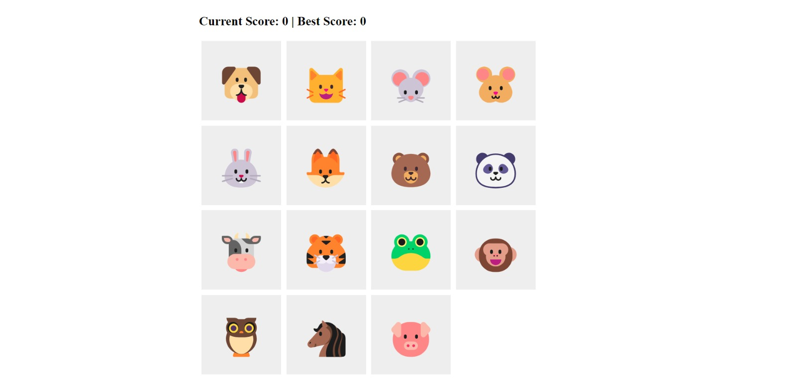

# Memory Game

This is a simple memory game built using React. The game presents a grid of cards, and the objective is to not click on card any more than once.

## Technologies Used

- React
- JavaScript
- HTML
- CSS

## Features

- Random shuffling of cards at the start of the game
- Get points by clicking on an image but don't click on any more than once
- Score tracking with a current score and best score display
- Persistence of the best score using browser's localStorage

## Demo

You can play the game online by visiting [Memory Game Demo](https://ikojun00.github.io/memory-game/)

## Screenshots

